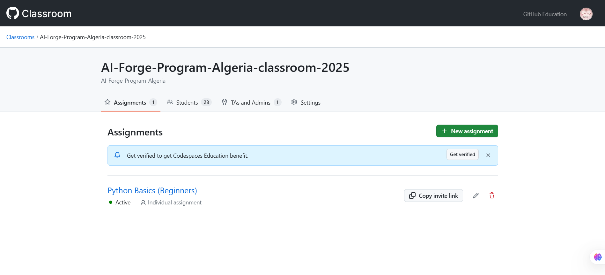

# AI-Forge-Course-2025

Welcome to the **AI Forge Program**! This program is designed to guide you through the foundations of Artificial Intelligence, Machine Learning, and Deep Learning over the course of seven weeks. Each week contains a dedicated folder with course materials, as well as corresponding Jupyter Notebooks to solidify your understanding with hands-on exercises.

For further details about the program, check the following [presentation](https://docs.google.com/presentation/d/1k9uvUfqTMalT8j9SnzeksyGvld_eqSPvc23mf_nkapc/edit#slide=id.p)

---

## Weekly Outline

| Week | Unit Name                              | Link to Course (GitHub Folder)                                    | Link to Notebook                                                     |
|:----:|:---------------------------------------|:------------------------------------------------------------------:|:---------------------------------------------------------------------:|
|  1   | **Array Algebra and NumPy**            | [Week 1 Folder](1_courses/2_advanced_track/1_array_algebra/) | [Array Algebra](1_courses/2_advanced_track/1_array_algebra/array_algebra.ipynb) |
|  2   | **Probabilistic Thinking**      | [Week 2 Folder](https://github.com/AI-Forge-Program-Algeria/AI-Forge-Course-2025/tree/main/1_courses/2_advanced_track/2_probabilistic_thinking) | [Part 1](https://github.com/AI-Forge-Program-Algeria/AI-Forge-Course-2025/blob/main/1_courses/2_advanced_track/2_probabilistic_thinking/01_Probabilistic_Thinking_and_Programming_Part1.ipynb) - [Part 2](https://github.com/AI-Forge-Program-Algeria/AI-Forge-Course-2025/blob/main/1_courses/2_advanced_track/2_probabilistic_thinking/02_Probabilistic_Thinking_and_Programming_Part2.ipynb) |
|  3   | **Machine Learning**  | [Week 3 Folder](https://github.com/AI-Forge-Program-Algeria/AI-Forge-Course-2025/tree/main/1_courses/2_advanced_track/Intro_ml) | [Intro to ML](https://github.com/AI-Forge-Program-Algeria/AI-Forge-Course-2025/blob/main/1_courses/2_advanced_track/Intro_ml/1_Introduction_to_ML.ipynb) [Own_Framework](https://github.com/AI-Forge-Program-Algeria/AI-Forge-Course-2025/blob/main/1_courses/2_advanced_track/4_Frameworks/OwnFramework.ipynb) [Intro_ML_Frameworks](https://github.com/AI-Forge-Program-Algeria/AI-Forge-Course-2025/blob/main/1_courses/2_advanced_track/4_Frameworks/Intro-ML-Frameworks.pdf) |
|  4   | **Computer Vision**                    | [Week 4 Folder](https://github.com/your-repo/AI-Forge/tree/main/Week4) | [CNNs]() [Transfer Learning]() [Auto Encoders]() [GANs]() [Object Detection]() [Segmentation]() |
|  5   | **Natural Language Processing**                      | [Week 5 Folder](https://github.com/your-repo/AI-Forge/tree/main/Week5) | [Week 5 Notebook](https://github.com/your-repo/AI-Forge/blob/main/Week5/Week5_Notebook.ipynb) |
|  6   | **Generative AI**                    | [Week 6 Folder](https://github.com/your-repo/AI-Forge/tree/main/Week6) | [LLMs]() [Diffusion Models]() |
|  7   | **Reinforcement Learning**            | [Week 7 Folder](https://github.com/your-repo/AI-Forge/tree/main/Week7) | [Week 7 Notebook](https://github.com/your-repo/AI-Forge/blob/main/Week7/Week7_Notebook.ipynb) |
|  8   | **Semi-supervised Learning**            | [Week 8 Folder](https://github.com/your-repo/AI-Forge/tree/main/Week7) | [Intro]() [Mean Teacher]() |
|  9   | **Segment Anything Models**            | [Week 9 Folder](https://github.com/your-repo/AI-Forge/tree/main/Week7) | [Week 9 Notebook](https://github.com/your-repo/AI-Forge/blob/main/Week7/Week7_Notebook.ipynb) |

---

## How to Use This Repository

1. **Clone or Download** this repository to your local machine.
2. Navigate to the folder for the week you want to work on.
3. Open the corresponding Jupyter Notebook to follow along with the lesson and complete the exercises.
4. Feel free to explore the other files and resources in each week’s folder.

---

## Assignments

1. All assignments will be done in [Github Classrooms](https://classroom.github.com/classrooms)

## Outline

| Assignment No. | Title                              | Link to Repo                                    | Link to Notebook                                                     |
|:----:|:---------------------------------------|:------------------------------------------------------------------:|:---------------------------------------------------------------------:|
|  1   | **Climate Stakeholders Quest - Part 1**            | [Assignment Folder](https://github.com/AI-Forge-Program-Algeria/exploratory-data-analysis-assignment) | [Exploratory Data Analysis](https://github.com/AI-Forge-Program-Algeria/exploratory-data-analysis-assignment/blob/main/assignmnent_1_eda.ipynb) |
|  1   | **Climate Stakeholders Quest - Part 2**            | [Assignment Folder]() | [Forecasting The Future]() |

---

## AI Forge Special Guest Sessions

| Guest | Title                              | Link to Webinar                                    | Link to Resources                                                     |
|:----:|:---------------------------------------|:------------------------------------------------------------------:|:---------------------------------------------------------------------:|
|  Nazim Bendib   | **Introduction to Reinforcement Learning**            | [Youtube]() | [Slides](https://www.youtube.com/watch?v=9XJZ8751q5k) |
|  Afaf Taik   | **A "short" Introduction to Fairness in Machine Learning**            | [Youtube](https://youtu.be/Ah3jMdlb6LM) | [Slides]() |
|  Narimane Hennouni   | **AI Agents: The New Era of Artificial Intellligence**            | [Youtube](https://youtu.be/haeMu5dxCBM) | [Slides]() |
|  Yacine Mahdid   | **How AI can Drive Sustainability in Aerospace Supply Chain**            | [Youtube](https://youtu.be/Q6sXM2mkEM0) | [Slides]() |
|  Raoul de Charette   | **Tale Of Understanding Images**            | [Youtube](https://youtu.be/_Gmnd972YOM) | [Slides]() |
|  Imane Hamzaoui   | **From Neuroscience to Artificial Intelligence**            | [Youtube]() | [Slides]() |
|  Assala Benmalek   | **The Tale of LLMs**            | [Youtube]() | [Slides]() |
|  Alaa Dania Adimi   | **Introduction to NLP**            | [Youtube]() | [Slides]() |
|  Nour Islam Mokhtari   | **AI For Healthcare Discussion**            | [Youtube]() | [Slides]() |
|  Redouane Lguensat   | **How AI is Revolutionizing Weather Forecasting**            | [Youtube]() | [Slides]() |
|  Omayma Mahjoub   | **Hands-On RL: Creating 2048 for RL Agents**            | [Youtube]() | [Slides]() |
|  Yazid Anis Ikrouberkane   | **Hands-on Data Collection From Sensors**            | [Youtube]() | [Slides]() |
<!--

|  Girmaw Abebe Tadesse   | **AI Applications for African Challenges**            | [Youtube]() | [Slides]() |
|  Dr Khalil Mrini   | **Introduction to Large Language Models**            | [Youtube]() | [Slides]() |
|  Hachem Betrouni   | **AI Product Deployment**            | [Youtube]() | [Slides]() |
|  Khayra Lakhdari   | **Introduction to Multimodal AI**            | [Youtube]() | [Slides]() |
|  Zoheir Bessai   | **Introduction to SearcH Algorithms**            | [Youtube]() | [Slides]() |
|  Nouhaila Innan - Walid Al maouaki - Yousra Farhani   | **AI and Quantum Computing Panel Discussion**            | [Youtube]() | [Slides]() |

--!>

---

## Contributing

Contributions are welcome! If you have any improvements to suggest or would like to add additional materials, please open an [issue](https://github.com/your-repo/AI-Forge/issues) or submit a pull request.

---

## License

This project is licensed under the [MIT License](LICENSE.md).

---
## Acknowledgment

Big thanks to [Deep Learning Indaba](https://github.com/deep-learning-indaba) for the amazing resources !

